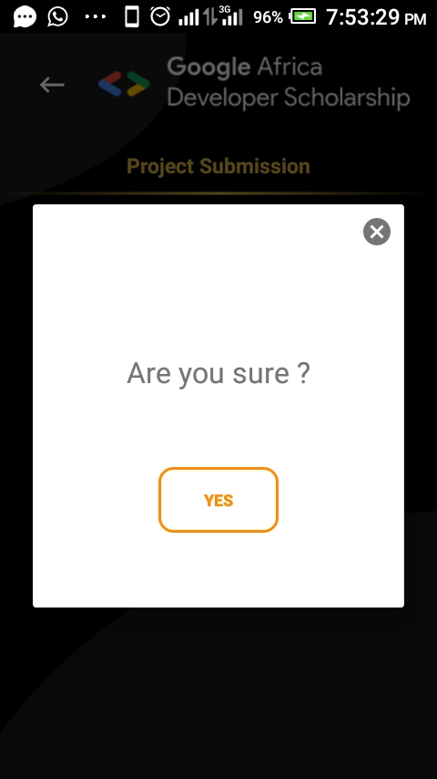

# GADS-LeaderBoard
This app is created using the Retrofit library to parse, get and post data from the app to a server and also I used the glide library to get bitmaps from the server.
Below are the UI screenshots:

## Result screenshots

